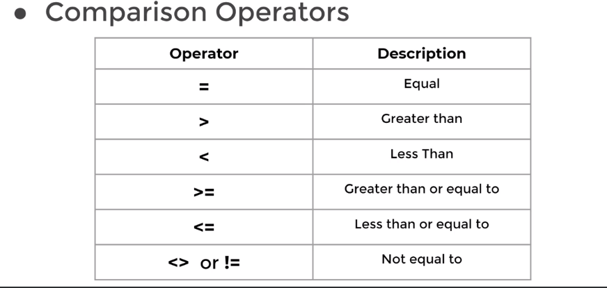

# SQL - Structured Query Language

- [𝕏@sh3llvik](https://x.com/sh3llvik)
- [SQL Query Fundamentals](#sql-fundamantals)
    - [Cheat Sheet](#cheat-sheet)
    - [SQL Statement Fundamentals](#sql-statement-fundamentals)
- Resouces.
- Leetcode SQL 50 solutions.
## Repository Structure
```bash
sql-data-query
├── leetcode-sql-50
│   └── README.md
├── README.md
├── resources
│   └── DBMS_Full_Notes.pdf
└── src
    ├── dvdrental.tar
    └── sql-cheat-sheet.png
```
# PostgresSQL Environment Setup
## Command Line Approach
- OS: Ubuntu Linux.
- Install PostgreSQL
```bash
sudo apt install postgresql
```
- Check status and version:
```bash
/etc/init.d/postgresql status && psql --version
```
- Restarting PostgreSQL with service commnand:
```bash
sudo service postgresql restart
```
- Alternatively restarting PostgreSQL with pg_ctl command:
```bash
sudo ln -s /usr/lib/postgresql/$(psql --version | cut -d" " -f 3 | cut -d"." -f1)/bin/pg_ctl /usr/bin/pg_ctl

sudo -u postgres pg_ctl restart -D /var/lib/postgresql/$(psql --version | cut -d" " -f 3 | cut -d"." -f1)/main
```
- Restore example database for practice:
- Downlaod [dvdrental.tar](src/dvdrental.tar)
#### Create a new empty `dvdrental` database:
```bash
psql -U postgres
```
 - psql: error: connection to server on socket "/var/run/postgresql/.s.PGSQL.5432" failed: FATAL:  Peer authentication failed for user "postgres"
 - To fix the above error, need to enable peer auth.
```bash
sudo vim /etc/postgresql/$(psql --version | cut -d" " -f 3 | cut -d"." -f1)/main/pg_hba.conf
```
- In the above file change the line:  
`local   all   postgres   peer` -> `local   all   postgres   md5`
- Restart service
```bash
sudo systemctl restart postgresql
```
- Create a password for user postgres:
```bash
sudo -i -u postgres
psql -c "ALTER USER postgres WITH PASSWORD 'pgpass123';"
```
- Now log in with:
```bash
sudo psql -U postgres -W
```
- Create an empty database named `dvdrental`:
```sql
create database dvdrental;
```
- Exit and restore the dvdrental database form backup file using `pg_restore`:
```bash
pg_restore -U postgres -d dvdrental /path/to/dvdrental.tar
```
- **Connect to `dvdrental` database**:
```bash
psql -U postgres -d dvdrental
```
- *List available commands in psql prompt:*
```psql
\?
```
- *List tables:*
```psql
\dt
```
## GUI Approach
- Downlaoad DBeaver Community(Debian package):
[Download Link](https://dbeaver.io/download/2/)
- Install DBeaver Community:
```bash
sudo dpkg -i dbeaver-ce_<version>_amd64.deb && dbeaver
```
- Create a database: `Ctrl+Shift+N` -> PostgrSQL -> Driver Properties(Install drivers) -> Finish.
- Restore database tar file: postgres-> Databases -> postgres -> tools -> restore.
---

# SQL Query Fundamantals
## Cheat Sheet

## SQL Statement Fundamentals
---
### SELECT Statement
- `SELECT`  is the most common statement used, and it allows us to retrieve information form a table.
- `SELECT` statement general syntax:
```sql
SELECT column_name FROM table_name;
```
- In order to select multiple columns, use `,` in between column names:
```sql
SELECT col1,col2,col3 FROM table_name;
```
- Select every column form table:
```sql
SELECT * FROM table_name;
```
- In general it is not a good practice to use an astrisk(`*`) in SELECT statement if you don't really need all the columns.
    - Why? It will automatically query everything, which will increase the traffic between the database server and the application, which can slow down the retrieval of results.
- SQL is not case-sensitive, but capitalizing keywords can enhance readability.
---
#### SELECT DISTINCT
- Sometimes table contains a column that has duplicate values, and to list only the unique values we use `DISTINCT` keyword.
- The `DISTINCT` keyword operates on column.
	- syntax :
     ```sql
     SELECT DISTINCT(column_name) from table_name;
     ```
	- It can be written without parenthesis also.
---
#### SELECT COUNT
- The `COUNT` function returns the number of input rows that match a specific condition of a query.
- We can apply `COUNT` on a specific column or just pass `COUNT(*)`.
- Count distinct names from a table:
```sql
SELECT COUNT(DISTINCT col_name) FROM table;
```
---
#### SELECT WHERE
- The `WHERE` statement allows us to specify conditions on columns for the rows to be returned.
- Syntax:
```sql
SELECT col1,col2,col3 from table_name WHERE
conditions;
```
- The conditions are used to *filter the results* returned form the SELECT statement.
##### Comparison Operators
- Compare a column value to something:


- Example syntax:
```sql
SELECT name,choice FROM film WHERE name = 'sh3llvik' OR choice = 'Fight Club';
```
---
#### ORDER BY
- PostgreSQL sometimes returns the request query results in different order. 
- You can use ORDER BY to sort rows based on column value, in either ascending or descending order.
- `ORDER BY` is towards the end of the query since we want to do any selection and filtering first before finally sorting.
- Syntax:
```sql
SELECT column_1,column_2 FROM table ORDER BY column_1 <ASC/DESC>
```
- `ASC` : Sort in ascending order.
- `DESC` : Sort in descending order.
- Leaving it blank will perform ascending by order by default.
---
#### LIMIT
- The `LIMIT` command allows us to limit the number of rows returned for the query.
- Useful for not wanting to return every single row in a table but only the top few rows to get an idea of the table layout.
- `LIMIT` also becomes useful in combination with `ORDER BY`.
- `LIMIT` goes at the very end of query request and is the last command to be executed.
- Example:
```sql
select * from payment
order by payment_date desc
limit 5;
```
#### BETWEEN
- The `BETWEEN` operator can be used to match a value against a range of values:
	- Value BETWEEN low AND high
	- same as: value >=low AND value <=high : inclusive.
	- value BETWEEN low AND high.
- This can be combined with NOT logical operator.
	- `value NOT BETWEEN low AND high`
- The `BETWEEN` operator can also be used with dates. 
- *Note: You need to format dates in ISO 8601 standard format, which is YYYY-MM-DD*.
- Example: `date BETWEEN '2007-01-01' AND '2007-02-01'`
---
#### IN
- In certain cases you want to check for multiple possible value options, example - if a user's username show up IN a list of known names.
- We can use the `IN` operator to create a condition that checks to see if a value included in list of multiple options. It can be combined with `not`.
- General syntax : `value IN (option1,option2,...,option_n)`
```sql
SELECT * FROM payment
WHERE amount IN (0.99,1.98,1.99)
```
---
#### LIKE and ILIKE
- If we want to match against a general pattern string we use this.
	- All emails ending in @gmail.com.
	- All names that begin with A.
- The `LIKE` operator allows us to perform pattern matching against string data with the use of **wildcard** characters:
	- Percent `%`
		- Matches any sequence of characters
			- All names that begin with A.
				- `WHERE name LIKE 'A%';`
			- All names that end with an a.
				- `WHERE name LIKE '%a';`
	- Underscore `_`
		- Matches any single character.
	- Using the underscore allows us to replace just a single character.
		- Get all Mission Impossible films.
			- `WHERE title LIKE 'Mission Impossible _';`
		- Multiple `_` can be used:
			- Format: Version#1.2 , Version#2.3
			- `WHERE version LIKE 'Version#__`
- We can combine pattern matching operators to create more complex patterns.
	- `WHERE name LIKE '_her%'`
		- Cherly
		- Theresa
		- Sherri
- *LIKE is case-sensitive, we can use ILIKE which is case-insensitive.*
- PostgreSQL Regex: [Documentation](https://www.postgresql.org/docs/current/functions-matching.html)
